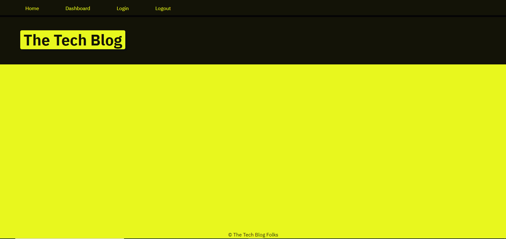
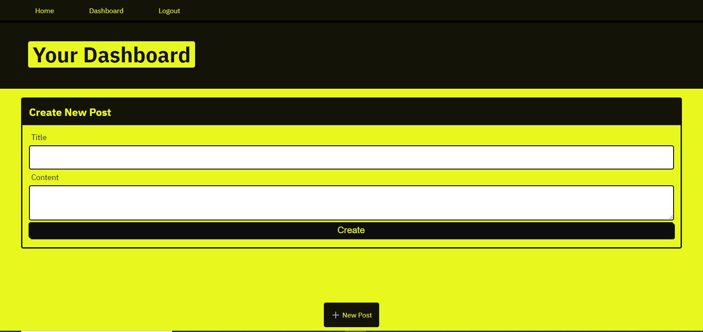

  

   
   # Tech Blog
  

badges();
## Table of Contents
* [Description](#description)
* [Installation](#installation)
* [Usage](#usage)
* [License](#license)
* [Contributors](#contributors)
* [Tests](#tests)
* [Deployment](#deployment)
* [Questions](#questions)

## Description:
This app is a blog site where a Person can review and leave comments in a Blog about technology.

## Installation:
Clone from the Github Repository. 

## Usage:
Once it is installed, run npm install. Create your .env file with your password to mysql and secret. Go to the Main directory. Activate the database from the command line by running mysql -u root -p and enter your database password. Quit the mysql command line. Run npm start. It will start the server. You can then go to the localhost and see the page locally.

## License:
This Repository is covered under the following license: [ISC] 

## Contributors:
Stephen Pena

## Images:

## Tests:
Needed to run post and get tests.

## Deployment:
https://ancient-badlands-06084.herokuapp.com/

## Questions
Contact me: Stephen
Github: [https://github.com/penaone](https://github.com/penaone)
Email: [penaone@gmail.com](penaone@gmail.com)
